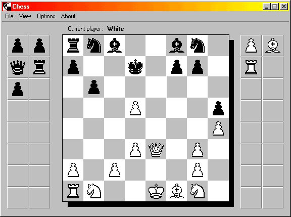



## Chess

### Description

Allows you to play chess against another person, no AI here I'm afraid.
 
### More Info
 
All the code that deals with the chess side is all mine. There are odd bits like the menu drawing and the imagelist control that are not.

The coding is not brilliant, and the slightly transparent bit where you drag the peices was added at the last minute and could be vastly improved.

Hope I've said every thing right, I wouldn't mind any feed back, good or bad!!!

             |
---                |---
**Submitted On**   |2000-02-29 19:06:28
**By**             |[Gary Eyles](https://github.com/Planet-Source-Code/PSCIndex/blob/master/ByAuthor/gary-eyles.md)
**Level**          |Intermediate
**User Rating**    |4.9 (34 globes from 7 users)
**Compatibility**  |VB 5\.0, VB 6\.0
**Category**       |[Games](https://github.com/Planet-Source-Code/PSCIndex/blob/master/ByCategory/games__1-38.md)
**World**          |[Visual Basic](https://github.com/Planet-Source-Code/PSCIndex/blob/master/ByWorld/visual-basic.md)
**Archive File**   |[CODE\_UPLOAD36922292000\.zip](https://github.com/Planet-Source-Code/gary-eyles-chess__1-6328/archive/master.zip)

